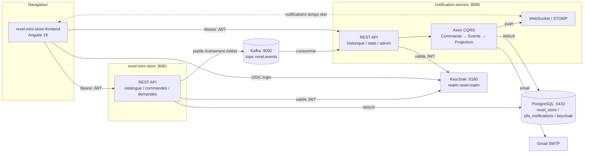

# Rexel Mini Store — Plateforme de Notification Multi-Canal

> Projet de Fin d'Année (PFA) — ISIBD. Système de notification événementiel (Push / Email / SMS) branché sur un mini e-commerce B2B, construit avec Spring Boot, Kafka, Axon Framework (CQRS), Keycloak et Angular.

**Cadre du projet** : exercice académique isolé, non intégré à la véritable plateforme Rexel — voir [Contexte](#contexte).

---

## Sommaire

- [Architecture](#architecture)
- [Fonctionnalités](#fonctionnalités)
- [Stack technique](#stack-technique)
- [Structure du dépôt](#structure-du-dépôt)
- [Démarrage rapide](#démarrage-rapide)
- [Configuration Keycloak](#configuration-keycloak)
- [Comptes de démonstration](#comptes-de-démonstration)
- [Documentation API](#documentation-api)
- [Catalogue des événements](#catalogue-des-événements--canaux)
- [État d'avancement](#état-davancement)
- [Contexte](#contexte)

---

## Architecture



Deux backends Spring Boot indépendants, couplés uniquement par Kafka (événements métier) et Keycloak (identité) :

- **`rexel-mini-store`** simule l'activité de vente (catalogue, commandes, stock, demandes de produit) et publie les faits métier sur Kafka.
- **`notification-service`** consomme ces événements, décide des canaux à utiliser, et distribue la notification (Push / Email / SMS), avec un historique complet géré en **CQRS via Axon Framework**.

---

## Fonctionnalités

### Boutique (`rexel-mini-store`)
- Catalogue produits (recherche, filtres catégorie/prix), fiche produit détaillée
- Commandes avec gestion de stock, annulation, cycle de statut (`PENDING → SHIPPED → DELIVERED` / `CANCELLED`)
- **Demande de produit** : un client peut demander un produit absent du catalogue → l'admin approuve ou refuse → notification dans les deux sens
- Espace admin : CRUD produits, gestion commandes (avec suivi lu/non-lu), gestion clients (téléphone modifiable), tableau de bord

### Notifications (`notification-service`)
- Ingestion Kafka des événements métier + décision automatique du/des canal(aux) par type d'événement
- Voie manuelle admin (notification envoyée à la main, sans passer par Kafka)
- **Canal Push** en temps réel (WebSocket/STOMP)
- **Canal Email** réel (Gmail SMTP, avec Reply-To dédié vers l'adresse admin)
- **Historique CQRS/Axon** : chaque notification est un agrégat (`Commands` → `Events` → `Projection`), avec suivi de statut de livraison (`PENDING` / `DELIVERED` / `FAILED`) et raison d'échec par canal
- Dashboard admin : historique filtrable, statistiques par canal (7 jours), page dédiée aux échecs de livraison

### Identité
- **Keycloak** comme unique fournisseur d'identité pour les deux services (SSO, rôles `ADMIN`/`USER`, plus de compte/mot de passe applicatif)

---

## Stack technique

| Domaine | Choix |
|---|---|
| Backend | Spring Boot 3.3.4, Java 21 |
| CQRS / Event Sourcing | Axon Framework 4.9.4 (event store JPA embarqué) |
| Message broker | Apache Kafka 3.7 (mode KRaft, sans Zookeeper) |
| Identité | Keycloak 25.0 (OIDC, thème de login personnalisé) |
| Base de données | PostgreSQL 16 |
| Temps réel | WebSocket / STOMP |
| Email | Spring Mail (Gmail SMTP) |
| Frontend | Angular 19 (standalone components), Tailwind CSS v4 |
| Documentation API | springdoc-openapi (Swagger UI) |

---

## Structure du dépôt

```
backend/
  rexel-mini-store/        # Boutique + producteur d'événements Kafka
  notification-service/    # Consommateur Kafka + CQRS/Axon + canaux de distribution
frontend/
  rexel-mini-store-frontend/  # Application Angular (client + espace admin)
keycloak-theme/
  rexel-theme/              # Thème de login Keycloak personnalisé
init-db/                    # Scripts de création des bases Postgres
docker-compose.yml           # Kafka, Kafka UI, PostgreSQL, Keycloak
rapport-avancement-pfa.md    # Rapport détaillé (conception, phases, diagrammes)
```

---

## Démarrage rapide

### Prérequis
- Docker Desktop
- Java 21+, Maven
- Node.js 20+ (Angular 19 CLI)
- Un compte Gmail avec un [mot de passe d'application](https://myaccount.google.com/apppasswords) (2FA requis) — pour le canal Email

### 1. Infrastructure

```bash
docker compose up -d
```

Démarre Kafka (`:9092`), Kafka UI (`:8090`), PostgreSQL (`:5433`, trois bases : `rexel_store`, `pfa_notifications`, `keycloak`) et Keycloak (`:8180`).

⚠️ Keycloak démarre à vide — voir [Configuration Keycloak](#configuration-keycloak) pour créer le realm, les clients et les comptes avant de lancer les backends.

### 2. Variables d'environnement (canal Email)

```powershell
setx GMAIL_USERNAME "ton-compte@gmail.com"
setx GMAIL_APP_PASSWORD "xxxxxxxxxxxxxxxx"
```

Sans ces variables, le service démarre normalement mais l'envoi d'email échoue (`deliveryStatus: FAILED`) — le reste de l'application n'est pas affecté.

### 3. Backends

```bash
cd backend/notification-service && mvn spring-boot:run   # :8080
cd backend/rexel-mini-store && mvn spring-boot:run        # :8081
```

### 4. Frontend

```bash
cd frontend/rexel-mini-store-frontend
npm install
npx ng serve   # http://localhost:4200
```

---

## Configuration Keycloak

Aucun export de realm n'est fourni — configuration manuelle une fois, via la console admin (`http://localhost:8180`, `admin`/`admin`) :

1. Créer le realm **`rexel-realm`**
2. Créer le rôle realm **`ADMIN`** et **`USER`**
3. Client public **`rexel-app`** : Standard Flow + Direct Access Grants activés (utilisé par le frontend)
4. Client confidentiel **`rexel-mini-store-service`** : Service Accounts activé, rôles `manage-users`/`view-users`/`query-users` sur `realm-management` (permet à `rexel-mini-store` d'appeler l'API Admin Keycloak)
5. Créer les utilisateurs de test (email/prénom/nom obligatoires, sinon erreur *"Account is not fully set up"*)

## Comptes de démonstration

| Rôle | Username | Mot de passe |
|---|---|---|
| ADMIN | `admin` | `admin123` |
| USER | `john` | `john123` |

---

## Documentation API

Swagger UI, une fois les backends démarrés :

- `rexel-mini-store` → http://localhost:8081/swagger-ui/index.html
- `notification-service` → http://localhost:8080/swagger-ui/index.html

## Catalogue des événements → canaux

| Événement Kafka | Canaux | Destinataire |
|---|---|---|
| `ORDER_CREATED` | Push + Email | Client |
| `ORDER_SHIPPED` | Push + Email | Client |
| `ORDER_DELIVERED` | Push + Email | Client |
| `ORDER_CANCELLED` | Push | Client |
| `ADMIN_NEW_ORDER` | Push | Admin |
| `LOW_STOCK_ALERT` | Email | Admin |
| `PRODUCT_REQUEST_CREATED` | Push + Email | Admin |
| `PRODUCT_REQUEST_APPROVED` | Push + Email | Client |
| `PRODUCT_REQUEST_REJECTED` | Push + Email | Client |

Décidé dans `ChannelDecisionService` (`notification-service`) — une notification manuelle envoyée par l'admin passe directement par `POST /api/admin/notifications` (REST), jamais par Kafka.

---

## État d'avancement

✅ Fait : Keycloak (SSO), Kafka, CQRS/Axon, Push, Email réel, suivi des échecs de livraison, historique + statistiques admin, demande de produit, Swagger/OpenAPI.

⏳ En cours / à venir : canal SMS, tests automatisés, Dockerfiles/Kubernetes/CI-CD.

Détail complet des phases et des choix d'architecture : [`rapport-avancement-pfa.md`](rapport-avancement-pfa.md).

---

## Contexte

Ce projet est un exercice académique **isolé**, réalisé dans le cadre d'un PFA à l'ISIBD. Il simule le nom et l'activité de l'entreprise Rexel à titre d'illustration pédagogique, mais **n'est en aucun cas connecté, affilié ou intégré** au véritable système d'information de Rexel.
