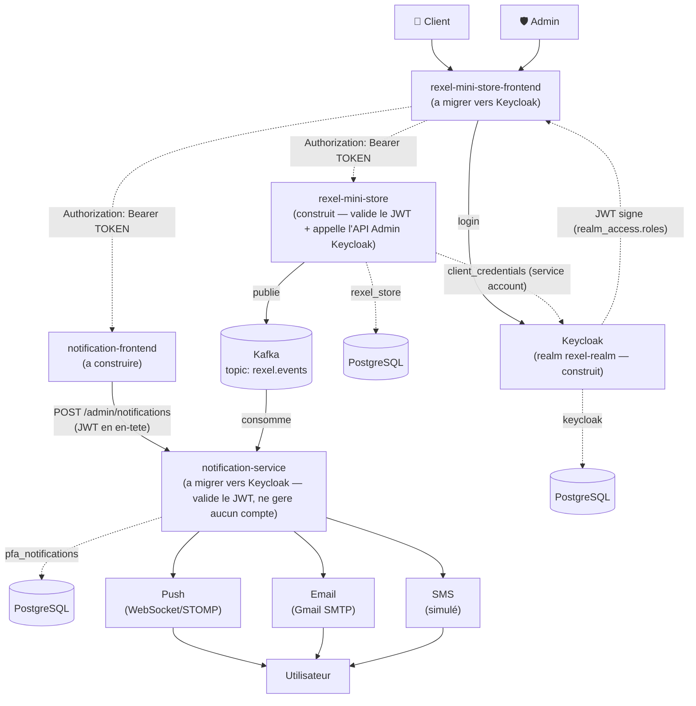
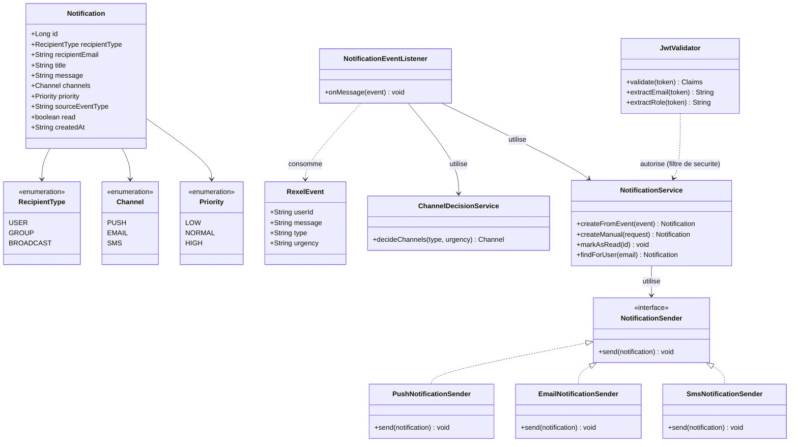
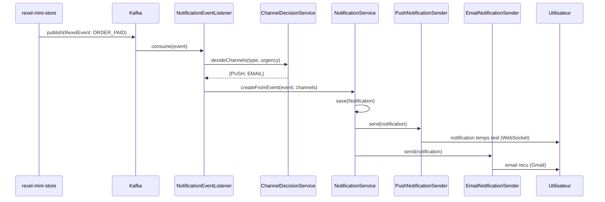
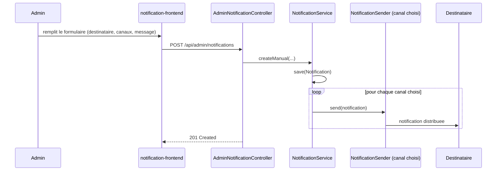

# Rapport d'avancement — PFA Système de Notification Multi-Canal

*Dernière mise à jour : 2026-07-23*

---

## 1. Résumé du travail réalisé

### 1.1 Infrastructure (`docker-compose.yml`)

- **PostgreSQL** — trois bases dans le même conteneur `pfa-postgres` (port hôte `5433`) : `rexel_store` (mini-store), `pfa_notifications` (notification-service), `keycloak` (ajoutée le 2026-07-21)
- **Kafka** (mode KRaft, un seul conteneur, sans Zookeeper) + **Kafka UI** (`http://localhost:8090`) pour visualiser les topics — remplace RabbitMQ initialement prévu (⚠️ bascule décidée le 2026-07-11, **pas encore validée avec l'encadrant**, à mentionner en soutenance)
- **Keycloak** (ajouté le 2026-07-21, directive de l'encadrant — voir 1.2ter) — serveur d'identité (IAM), conteneur `pfa-keycloak`, image `quay.io/keycloak/keycloak:25.0`, mode `start-dev`, console d'admin sur `http://localhost:8180`, persistance dans la base `keycloak` du Postgres partagé

### 1.2 Backend `rexel-mini-store` (Spring Boot 3 / Java 21)

Mini e-commerce B2B simulant l'activité de vente Rexel, générateur d'événements réels pour le futur système de notification :

- **Authentification** — ✅ **Keycloak** (voir 1.2ter, remplace la Phase 0/JWT custom décrite en 1.2bis, devenue historique) : `rexel-mini-store` ne gère plus aucun compte ni mot de passe, il valide les tokens émis par Keycloak
- **Catalogue produits** : liste, détail, catégories, notes/avis (données de démo), spécifications techniques, image (réelle ou icône générée en repli)
- **Commandes** : création avec quantité et calcul automatique du total, vérification de stock, annulation (si en attente), **simulation de paiement** (formulaire de carte factice → statut `PENDING → PAID`)
- **Cycle de statut** : `PENDING → PAID → SHIPPED → DELIVERED` ou `CANCELLED`
- **Espace Admin** : CRUD produits, gestion des commandes (filtre + changement de statut), liste clients, tableau de bord (compteurs + chiffre d'affaires)
- Architecture propre : Controller → Service → Repository, DTOs + Mappers dédiés, exceptions métier

### 1.2bis Upgrade de l'authentification `rexel-mini-store` (Phase 0) — ✅ terminée, puis **remplacée par Keycloak** (voir 1.2ter)

> 📜 Section conservée pour l'historique. Ce système d'auth JWT custom (BCrypt + `JwtService`) a été entièrement retiré le 2026-07-21 au profit de Keycloak — voir 1.2ter pour l'état actuel.

Réalisée les 2026-07-13/14. Objectif : remplacer l'auth simulée (mot de passe en clair, pas de token) par une vraie auth JWT, puisque `rexel-mini-store` devient l'unique émetteur d'identité pour tout le système (voir section 2.1 pour le détail de la décision).

- ✅ **`pom.xml`** : ajout de `spring-boot-starter-security` (apporte `BCryptPasswordEncoder` pour hasher les mots de passe) et des trois dépendances `jjwt-*` (génération du token JWT — mêmes bibliothèques que celles prévues pour `notification-service`, pour rester cohérent).
  **Point de vigilance identifié** : ajouter `spring-boot-starter-security` active par défaut un verrouillage total de toutes les routes (Spring Security bloque tout par une authentification HTTP Basic tant qu'aucune config personnalisée n'est fournie) — d'où la nécessité de `SecurityConfig` ci-dessous.
- ✅ **`application.yml`** : ajout du bloc `app.jwt.secret`/`expiration-ms`, avec **exactement la même valeur par défaut** que celle de `notification-service` — c'est ce secret partagé qui permettra à `notification-service` de valider un token émis ici, sans base de comptes commune.
- ✅ **`SecurityConfig`** : `@Bean PasswordEncoder` (BCrypt) + `@Bean SecurityFilterChain` — CSRF désactivé (API stateless, pas de formulaire HTML), CORS délégué à `CorsConfig` existant, session `STATELESS` (aucun `HttpSession` créé côté serveur), et **toutes les routes laissées ouvertes** (`permitAll()`) volontairement : le filtrage par rôle n'est pas l'objet de cette phase, il ne fallait juste pas casser les endpoints déjà testés du mini-store.
- ✅ **`JwtService`** : génère le token au login — sujet = email, claim `role` = ADMIN/USER, signé HS256 avec la clé dérivée de `app.jwt.secret`, expiration 2h (`app.jwt.expiration-ms`).
- ✅ **`AuthService`** : `login()` utilise désormais `passwordEncoder.matches(...)` (au lieu d'un `.equals()` en clair) puis génère un token via `JwtService` ; `register()` hash le mot de passe avec `passwordEncoder.encode(...)` avant sauvegarde — indispensable, sinon les nouveaux comptes auraient un mot de passe en clair qui ne matcherait jamais au login.
- ✅ **`data.sql`** : les 3 comptes de démo (`admin@rexel.com`, `mohammed@rexel.com`, `sara@rexel.com`) ont désormais un hash BCrypt en base au lieu du mot de passe en clair — les mots de passe réels utilisés pour se connecter n'ont pas changé (voir 1.6).
- ✅ **`LoginResponse` / `StoreUserMapper` / `AuthController`** : le login renvoie maintenant un champ `token` en plus du profil ; `register` continue de renvoyer un `LoginResponse` sans token (l'inscription ne connecte pas automatiquement l'utilisateur).
- ✅ **Test de bout en bout** (via `curl`, backend démarré localement + PostgreSQL Docker) : login avec bon mot de passe → JWT valide retourné ; mauvais mot de passe → 400 `"Email ou mot de passe incorrect"` ; inscription d'un nouveau compte suivie d'un login avec ce même mot de passe → fonctionne, confirmant que le hash est cohérent entre écriture (`register`) et lecture (`login`).

### 1.2ter Migration vers Keycloak — ✅ terminée côté `rexel-mini-store` (2026-07-21)

> 📌 **Directives de l'encadrant reçues le 2026-07-20** (donc validées, contrairement à la bascule Kafka qui est une décision personnelle) : utiliser **Keycloak** pour la gestion des utilisateurs (remplace tout le login), et **Axon Framework/CQRS** pour la partie historique des notifications dans `notification-service` (voir section 3, pas encore commencé).

**Infrastructure Keycloak** :
- Conteneur `pfa-keycloak` ajouté à `docker-compose.yml`, base dédiée `keycloak` dans le Postgres partagé
- Realm `rexel-realm` créé (espace isolé : users/rôles/clients propres à ce projet, séparé du realm `master` réservé à l'administration de Keycloak lui-même)
- Client public `rexel-app` (Standard Flow + Direct Access Grants activés) — utilisé par le frontend et pour les tests
- Client confidentiel `rexel-mini-store-service` (service account, rôles `manage-users`/`view-users`/`query-users` sur `realm-management`) — permet au backend d'appeler l'**API Admin de Keycloak** en son propre nom (`client_credentials` grant), pour lister/modifier les utilisateurs
- Rôles realm `ADMIN`/`USER`, utilisateurs de test `admin`/`admin123` (rôle ADMIN) et `john`/`john123` (rôle USER)
- **Piège rencontré** : erreur `"Account is not fully set up"` au login — cause : le realm exige `email`/`firstName`/`lastName` pour qu'un compte soit "complet" (config "User Profile"), or les comptes de test avaient été créés avec juste un username. Corrigé en complétant les profils. Retenu pour la suite : toujours remplir ces 3 champs à la création d'un utilisateur Keycloak.

**Côté `rexel-mini-store`** — remplacement complet de l'auth JWT custom :
- ✅ Supprimés : `StoreUser`, `StoreRole`, `StoreUserRepository`, `AuthService`, `JwtService`, `AuthController`, `LoginRequest`/`RegisterRequest`/`LoginResponse`, `StoreUserMapper`, `InvalidCredentialsException`, `EmailAlreadyUsedException`, comptes dans `data.sql`, dépendances `jjwt-*` — Keycloak est désormais l'unique source de vérité pour les comptes
- ✅ `pom.xml` : ajout `spring-boot-starter-oauth2-resource-server` (validation JWT standard OIDC) et `keycloak-admin-client` (appels à l'API Admin de Keycloak)
- ✅ `application.yml` : `spring.security.oauth2.resourceserver.jwt.issuer-uri` pointant vers `http://localhost:8180/realms/rexel-realm` (Spring récupère automatiquement les clés publiques de Keycloak à cette adresse pour vérifier les signatures — plus aucun secret partagé fait main)
- ✅ `KeycloakAdminConfig` (nouveau) : bean `Keycloak` (client admin) authentifié via le service account `rexel-mini-store-service`
- ✅ `SecurityConfig` réécrit : `oauth2ResourceServer().jwt()` + un `JwtAuthenticationConverter` personnalisé qui lit le claim imbriqué `realm_access.roles` de Keycloak (absent du comportement par défaut de Spring Security) et le transforme en `ROLE_ADMIN`/`ROLE_USER` — sans ça, `hasRole("ADMIN")` échoue silencieusement. Règles d'accès enfin réelles : `/api/products/**` public, `/api/admin/**` réservé à `ADMIN`, le reste juste authentifié (contrairement à la Phase 0 qui laissait tout ouvert)
- ✅ `UserController`/`UserService` réécrits : `GET/PUT /api/users/me` (identité déduite du token, plus de `{id}` dans l'URL) lisent/écrivent directement le profil **dans Keycloak** via l'API Admin (y compris un attribut custom `phone`, absent du schéma standard de Keycloak)
- ✅ `AdminCustomerController`/`AdminStatsService` réécrits : la liste des clients et le compteur clients du dashboard admin interrogent Keycloak au lieu de la table locale `store_users` (qui n'existe plus)
- ✅ `CustomerResponse`/`UserProfileResponse` : l'id passe de `Long` à `String` (UUID Keycloak)
- ✅ **Testé de bout en bout** via `curl` : catalogue public accessible sans token (200) ; `/api/users/me` sans token → 401 ; avec token → profil correct lu depuis Keycloak ; `/api/admin/customers` avec un token ADMIN → liste des 2 comptes ; avec un token USER (`john`) → 403 (contrôle de rôle bien appliqué) ; modification du profil (`PUT /me`) → écrite et relue correctement dans Keycloak

**Frontend Angular migré et testé le 2026-07-21 aussi** (voir 1.3) — plus de casse restante côté `rexel-mini-store`. Seul `notification-service` reste sur son ancien `JwtValidator`/`JwtAuthFilter` (secret partagé) — à migrer vers Keycloak également, prévu être fait par l'étudiant lui-même.

**Thème de login Keycloak personnalisé** (2026-07-21, sur demande de l'étudiant avec une maquette de référence) : la page de login/inscription hébergée par Keycloak utilisait par défaut le thème "polygones gris" — remplacé par un thème custom (`keycloak-theme/rexel-theme/`, monté en volume Docker dans `docker-compose.yml`) qui reprend une identité visuelle bleue Rexel proche de la maquette fournie : logo (icône éclair sur badge bleu arrondi), titre + sous-titre ("Welcome Back" / "Create Account"), icônes dans les champs (email, cadenas, personne), case "Remember me" + lien "Forgot Password?" activés côté realm, bouton bleu, lien de pied de page, champs Prénom/Nom côte à côte à l'inscription.

- **Technique** : le thème étend `keycloak.v2` (thème par défaut, basé sur PatternFly v5). Les templates `login.ftl`/`register.ftl`/`template.ftl` du thème de base ont été extraits du jar Keycloak, copiés dans le thème custom, puis légèrement modifiés (ajout du sous-titre, de l'icône d'en-tête, du texte de pied de page, et d'une `
` enveloppant Prénom/Nom pour l'affichage côte à côte) ; le CSS (`login/resources/css/styles.css`) gère les couleurs, les icônes de champs (SVG en `background-image`) et la mise en page
- **Textes personnalisés** via `login/messages/messages_en.properties` (surcharge de clés existantes comme `loginAccountTitle`, plus des clés custom comme `rexelLoginSubtitle`)
- **Piège rencontré** : une tentative de mise en page 2 colonnes via CSS pur (`:has()` puis `:nth-of-type()`) matchait bien les éléments (vérifié en debug) mais ne s'affichait jamais visuellement, pour une raison non élucidée — remplacé par une solution plus fiable : envelopper directement les deux champs dans un `
` via le template, ciblé ensuite en CSS simple (`display: flex`)
- Realm renommé "Rexel Mini Store" (`displayName`) pour un affichage plus propre
- Toujours le flow OAuth2 standard + redirection (pas de formulaire custom dans Angular) — seul l'habillage visuel change, la sécurité du flow reste identique
- **Testé de bout en bout avec Playwright** : rendu visuel conforme à la maquette (captures comparées), et le flow de login complet (redirection → formulaire → retour app → profil affiché) fonctionne toujours sans erreur après toutes ces modifications

### 1.3 Frontend `rexel-mini-store-frontend` (Angular 19 / Tailwind CSS v4) — migré vers Keycloak le 2026-07-21

- ✅ Dépendance `keycloak-js` installée (bibliothèque officielle, pas de wrapper Angular tiers — plus de contrôle, moins de risque d'incompatibilité de version)
- ✅ `AuthService` réécrit : garde volontairement la **même interface publique** (`currentUser$`, `isLoggedIn()`, `isAdmin()`, `requestLogin()`, `logout()`) qu'avant, mais branchée en interne sur une instance `Keycloak`. **Conséquence importante** : la plupart des composants consommateurs (navbar, guards, pages produits, mes commandes) n'ont **pas eu besoin de changer** — seule l'implémentation interne du service a changé, pas son contrat
- ✅ `auth.interceptor.ts` (nouveau) : intercepteur HTTP fonctionnel qui attache automatiquement `Authorization: Bearer <token>` à chaque appel vers les backends (`localhost:8081`/`8080`), avec rafraîchissement du token (`updateToken(30)`) avant chaque requête si besoin — **n'existait pas du tout avant** (l'ancienne "auth" ne protégeait déjà rien côté frontend)
- ✅ `app.config.ts` : ajout de `provideAppInitializer()` (nouvelle API Angular 19) pour attendre l'initialisation de Keycloak **avant** que l'application ne démarre — indispensable pour que les guards de route disposent déjà de l'état de connexion au premier rendu
- ✅ Supprimés : `LoginModalComponent` (le login redirige désormais vers la page hébergée par Keycloak, plus besoin de formulaire local) et `RegisterComponent`/route `/register` (idem, `keycloak.register()` redirige vers le formulaire d'inscription Keycloak)
- ✅ Auto-inscription activée sur le realm (`registrationAllowed: true`) + rôle `USER` ajouté au rôle composite par défaut du realm, pour que les comptes créés via l'auto-inscription Keycloak obtiennent automatiquement le rôle `USER` (comme avant avec `register()`)
- ✅ **Testé de bout en bout avec un vrai navigateur (Playwright)** : clic sur "Se connecter" → redirection vers Keycloak (flow standard OAuth2 + PKCE, géré automatiquement par `keycloak-js`) → formulaire de login → retour sur `localhost:4200` → navbar affichant le profil réel ("Admin Rexel") lu depuis Keycloak ; page Admin > Clients affichant les 2 comptes réels ; aucune requête backend en erreur ; déconnexion fonctionnelle (retour à l'état "Se connecter")

- Pages : Accueil, Produits (filtres catégorie/prix/recherche), Détail produit, Profil, Mes commandes, Espace Admin (dashboard/produits/commandes/clients) — plus de page Inscription dédiée, remplacée par la redirection vers Keycloak
- **Mode sombre/clair au choix de l'utilisateur**, persisté, appliqué à toute l'application
- Couleur de marque **bleue** (`#0066ff`), centralisée en un seul token de design
- Photos produits réelles + repli automatique sur icônes générées localement
- Guards de routes (connecté / rôle ADMIN), pagination, toasts succès/erreur, confirmations avant action destructive, responsive

### 1.4 Backend `notification-service` (Spring Boot 3 / Java 21) — 🚧 en cours

Démarré le 2026-07-13, suivi **fichier par fichier** avec explication avant chaque écriture (rythme différent et plus lent que `rexel-mini-store`, car c'est le vrai sujet évalué du PFA).

> ⚠️ **Décision architecturale prise en cours de route** : `notification-service` ne gérera **aucun compte utilisateur** (pas d'entité `User`, pas de login). C'est `rexel-mini-store` qui devient l'unique émetteur d'identité (JWT signé après vérification BCrypt) ; `notification-service` se contente de **valider** ces tokens via un secret partagé. Voir section 2.1/2.2 pour le détail. Ça implique une **Phase 0** supplémentaire : upgrader l'auth actuellement simulée du mini-store.

#### ✅ Phase 1 — Socle du projet (terminée le 2026-07-15)

En plus de `pom.xml`/`application.yml` (déjà faits) : `NotificationServiceApplication` (classe principale, manquante jusque-là), les enums `RecipientType` (`USER`/`GROUP`/`BROADCAST`), `Channel` (`PUSH`/`EMAIL`/`SMS`), `Priority` (`LOW`/`NORMAL`/`HIGH`), et l'entité JPA `Notification` (avec `Set<Channel> channels` via `@ElementCollection` — première fois qu'on utilise cette annotation, nécessaire car une notification peut partir sur plusieurs canaux à la fois). Toujours **pas d'entité `User`**, conformément à la décision d'architecture ci-dessus.

#### ✅ Phase 2 — Validation JWT — 📜 historique, **remplacée par Keycloak** (voir 1.2ter)

> Section conservée pour l'historique. `JwtValidator`/`JwtAuthFilter` (secret partagé fait main) ont été entièrement retirés le 2026-07-21 au profit de `spring-boot-starter-oauth2-resource-server` + Keycloak (même principe que `rexel-mini-store` : `SecurityConfig` avec `oauth2ResourceServer().jwt()` et un convertisseur de rôles lisant `realm_access.roles`). `/api/admin/**` reste réservé à `ADMIN`, le reste juste authentifié.

Objectif original (toujours valable) : `notification-service` doit savoir "qui" appelle (email + rôle) sans jamais gérer de comptes, en faisant confiance au JWT émis par un tiers.

#### 📌 Décision — taxonomie des événements Kafka (2026-07-15)

Le contrat d'événement initial (`RexelEvent` avec `type: "ORDER_SUCCESS"` générique) a été affiné avant d'attaquer la Phase 3, pour coller au cycle de vie réel des commandes déjà modélisé dans `rexel-mini-store` (`OrderStatus`: `PENDING → PAID → SHIPPED → DELIVERED` ou `CANCELLED`) :

| Événement Kafka | Déclenché par | Notification |
|---|---|---|
| `ORDER_CREATED` | Client | Commande enregistrée |
| `ORDER_PAID` | Client (paiement simulé) | Paiement confirmé |
| `ORDER_SHIPPED` | Admin | Commande expédiée |
| `ORDER_DELIVERED` | Admin | Commande livrée |
| `ORDER_CANCELLED` | Admin (ou client si en attente) | Commande annulée |
| `LOW_STOCK_ALERT` | Système (seuil de stock) | Alerte admin uniquement |

**Séparation actée avec les notifications manuelles** : ces 6 types sont les **seuls** événements qui transiteront par Kafka — ce sont des faits métier automatiques produits par `rexel-mini-store`. Une notification envoyée volontairement par un admin (ex: message personnalisé) ne passe **pas** par Kafka : elle utilise directement `POST /api/admin/notifications` (Phase 5, appel REST direct depuis le frontend admin). Cette séparation clarifie le rôle de Kafka comme bus d'événements métier uniquement, et évite de faire transiter des actions manuelles par un mécanisme prévu pour des faits automatiques.

`INVOICE_GENERATED` a été envisagé puis **écarté du périmètre actuel** : `rexel-mini-store` n'a aucun module de facturation (pas d'entité `Invoice`, pas de génération PDF) — ajouté aux points ouverts (section 4) comme amélioration future possible, pas engagée.

#### ✅ Phase 3 — Ingestion Kafka (terminée le 2026-07-18, testée de bout en bout)

- `RexelEvent` (package `com.pfa.rexel.notification.event`, pas une entité JPA) : DTO `userId`/`message`/`type`/`urgency`, désérialisé automatiquement depuis le JSON reçu sur le topic `rexel.events`
- `ChannelDecisionService` : logique métier en dur (V1, cf. règles métier) qui associe chaque `type` d'événement à un `Set<Channel>` — ex: `ORDER_PAID` → `{PUSH, EMAIL}`, `LOW_STOCK_ALERT` → `{EMAIL}`
- `NotificationEventListener` : `@KafkaListener(topics = "rexel.events", groupId = "notification-service")` — reçoit l'événement, appelle `ChannelDecisionService`, affiche le résultat (persistence + envoi réel pas encore branchés, arrivent en Phase 4/6/7/8)

**⚠️ Deux incidents rencontrés et corrigés pendant le test de bout en bout** (le producer Kafka de `rexel-mini-store` n'étant pas encore recablé, le test s'est fait en publiant un message directement dans Kafka via `kafka-console-producer`) :

1. **Message "poison" bloquant le consumer en boucle infinie** : un message resté dans le topic depuis un ancien test du 2026-07-11 référençait une classe (`com.pfa.rexel.store.event.RexelEvent`) absente du "trusted package" du consumer. Sans protection, Spring Kafka retentait indéfiniment ce même message à chaque poll — le log a atteint **4,7 Go en à peine 2 minutes** avant d'être stoppé manuellement. **Fix** : ajout d'un `ErrorHandlingDeserializer` (encapsule le `JsonDeserializer`) dans `application.yml`, qui permet à Spring Kafka de journaliser puis **sauter proprement** un message illisible au lieu de boucler dessus — protection indispensable contre tout futur message malformé, pas juste un correctif ponctuel.
2. **Désérialisation encore en échec après le fix ci-dessus**, pour une raison différente : par défaut, le désérialiseur JSON s'attend à un en-tête `__TypeId__` indiquant la classe Java cible — absent d'un message publié à la main, mais surtout **structurellement absent en production** aussi, puisque `rexel-mini-store` publierait avec **sa propre classe** (`com.pfa.rexel.store.event.RexelEvent`, package différent) que `notification-service` ne connaît pas dans son classpath. **Fix** : `spring.json.value.default.type` (force toujours la classe locale `RexelEvent`) + `spring.json.use.type.headers: false` (ignore tout en-tête de type venant du producteur) — le bon réglage microservices : seul le **contrat JSON** compte entre les deux services, jamais le nom de classe interne de l'émetteur.

Test final concluant : publication d'un événement `{"type":"ORDER_PAID", ...}` → log `Evenement recu: ORDER_PAID -> canaux: [EMAIL, PUSH]`, cohérent avec les règles métier.

#### 📌 Décision — nouveaux types d'événements (2026-07-21/22)

Deux ajustements décidés après coup sur le contrat Kafka :
- **`PRODUCT_REQUEST_CREATED`/`PRODUCT_REQUEST_APPROVED`/`PRODUCT_REQUEST_REJECTED`** : 3 nouveaux types, en prévision d'une fonctionnalité "demande de produit" (client cherche un produit absent du catalogue → peut le demander → l'admin approuve/refuse → le client est notifié du résultat). Pas encore implémentée côté `rexel-mini-store` (nouvelle entité `ProductRequest` à créer), mais les canaux sont déjà décidés dans `ChannelDecisionService` (Push + Email, comme les événements de commande).
- `ADMIN_MESSAGE` explicitement **écarté** du contrat Kafka : un message envoyé manuellement par un admin ne doit jamais transiter par Kafka (c'est la Phase 5, un appel REST direct) — la distinction "événement métier automatique (Kafka)" vs "action manuelle (REST)" reste stricte.

#### ✅ Phase 3 reconstruite + Phase 4 + Producer Kafka `rexel-mini-store` — terminées et testées de bout en bout (2026-07-22)

`RexelEvent`/`ChannelDecisionService`/`NotificationEventListener` ont été supprimés puis **réécrits à la main par l'étudiant** (guidé fichier par fichier), avec les 3 nouveaux types d'événements ajoutés à `ChannelDecisionService`. `NotificationEventListener` appelle maintenant `NotificationService.createFromEvent()` (Phase 4) au lieu d'un simple `println` de test.

**Phase 4 complétée** :
- `NotificationRepository` (`findByRecipientEmailOrRecipientType`, pour qu'un USER voit ses notifications ciblées **et** les diffusions générales)
- `NotificationService` : `createFromEvent()` (construit + sauvegarde une `Notification` à partir d'un `RexelEvent`, avec la conversion `urgency` → `Priority`), `markAsRead()`, `findForUser()`
- `NotificationController` : `GET /api/notifications/me` (identité lue directement depuis le token via `@AuthenticationPrincipal Jwt jwt`, pas de paramètre d'URL falsifiable) et `PATCH /api/notifications/{id}/read`

**Producer Kafka recablé côté `rexel-mini-store`** (retiré le 2026-07-11, reconstruit à l'identique dans l'esprit mais avec le contrat d'événements à jour) :
- `RexelEvent` (classe **dupliquée volontairement**, package `com.pfa.rexel.store.event` — aucune dépendance partagée entre les deux services, seulement un contrat JSON commun)
- `KafkaEventPublisher` : encapsule le `KafkaTemplate`, une méthode `publish(userId, message, type, urgency)`
- Branché dans les 4 méthodes de `OrderService` : `placeOrder()` → `ORDER_CREATED` (+ `LOW_STOCK_ALERT` si stock < 10 après décrément), `payOrder()` → `ORDER_PAID`, `cancelOrder()` → `ORDER_CANCELLED`, `updateStatus()` → `ORDER_SHIPPED`/`ORDER_DELIVERED`/`ORDER_CANCELLED` selon le statut cible

**Premier test de bout en bout réel réussi** (plus de publication manuelle via `kafka-console-producer` — cette fois, un vrai appel métier) :
1. Token Keycloak obtenu pour `john`
2. `POST /api/orders` sur `rexel-mini-store` → commande créée, stock décrémenté, événement `ORDER_CREATED` publié sur Kafka
3. `notification-service` consomme l'événement → `insert into notifications` observé dans les logs
4. `GET /api/notifications/me` (avec le token de John) → renvoie la notification (`title: "ORDER_CREATED"`, `channels: ["PUSH","EMAIL"]`, `read: false`)
5. `PATCH /api/notifications/1/read` → `read: true` confirmé à la relecture

**Premier vrai cycle métier complet** : commande → événement → notification persistée → consultation → marquage lu, à travers les deux services, avec la même identité Keycloak de bout en bout.

#### ✅ Phase 1, étape 1 — `pom.xml`

Squelette Maven du projet (`groupId: com.pfa.rexel`, `artifactId: notification-service`, Java 21, port prévu `8080` — libre car le mini-store occupe `8081`). Chaque dépendance a été choisie pour un besoin précis à venir :

| Dépendance | Pourquoi elle est là |
|---|---|
| `spring-boot-starter-web` | Exposer les futurs endpoints REST (consultation des notifications, envoi manuel admin) |
| `spring-boot-starter-security` | Filtrer chaque requête HTTP et **valider** le JWT (émis par `rexel-mini-store`) + lire le rôle (ADMIN/USER) dans ses claims |
| `spring-boot-starter-data-jpa` | Persister l'entité `Notification` vers PostgreSQL via Hibernate |
| `spring-boot-starter-validation` | Valider les DTOs entrants (ex: champs requis sur la création manuelle admin) |
| `postgresql` (runtime) | Driver JDBC pour se connecter à la base `pfa_notifications` |
| `spring-kafka` | Consommer le topic `rexel.events` publié par `rexel-mini-store` |
| `spring-boot-starter-mail` | Envoyer les notifications par email (canal Email, via Gmail SMTP) |
| `spring-boot-starter-websocket` | Pousser les notifications en temps réel vers le navigateur (canal Push, via STOMP) |
| `jjwt-api` / `jjwt-impl` / `jjwt-jackson` | **Valider** les tokens JWT émis par `rexel-mini-store` (secret partagé) — `notification-service` n'en génère aucun |
| `lombok` | Éviter le boilerplate (getters/setters/constructeurs) sur les entités et DTOs |
| `spring-boot-starter-test`, `spring-kafka-test`, `spring-security-test` | Dépendances de test (pas encore utilisées, prévues pour plus tard) |

**Pourquoi tout mettre dès le premier fichier ?** Contrairement à `rexel-mini-store` (où on avait ajouté les dépendances au fur et à mesure des besoins), ici le périmètre technique était déjà entièrement défini dans le cahier des charges — donc autant déclarer toutes les dépendances connues dès le départ, plutôt que de modifier le `pom.xml` à chaque nouvelle phase.

#### ✅ Phase 1, étape 2 — `application.yml`

Fichier de configuration Spring Boot. Chaque bloc correspond à une brique technique du cahier des charges :

| Bloc de config | Rôle |
|---|---|
| `server.port: 8080` | Port d'écoute du service |
| `spring.datasource` | Connexion à la base `pfa_notifications` (créée dans le même conteneur Postgres que `rexel_store`) |
| `spring.jpa.hibernate.ddl-auto: create-drop` | Hibernate recrée les tables à chaque démarrage à partir des entités `@Entity` (et les détruit à l'arrêt) — même choix que le mini-store, pour repartir sur une base propre à chaque démo |
| `spring.jpa.defer-datasource-initialization: true` | Force Spring à attendre qu'Hibernate ait créé les tables **avant** d'exécuter `data.sql` (sinon erreur "table introuvable") |
| `spring.sql.init.mode: always` | Exécute `data.sql` à chaque démarrage même avec une vraie base PostgreSQL (par défaut, Spring Boot ne le fait automatiquement que pour les bases embarquées comme H2) |
| `spring.kafka.bootstrap-servers` + `consumer.*` | Adresse du broker Kafka, identifiant du groupe de consommateurs (`group-id`), et surtout le **désérialiseur JSON** qui transformera automatiquement le message Kafka en objet Java (`RexelEvent`, à créer en Phase 3) — limité à un seul package "de confiance" par sécurité |
| `spring.mail.*` | Connexion SMTP à Gmail pour l'envoi réel d'emails. **Les identifiants (`username`/`password`) ne sont jamais écrits en clair** — ils sont lus depuis les variables d'environnement `GMAIL_USERNAME` et `GMAIL_APP_PASSWORD`, à définir sur la machine avant de lancer le service |
| `app.jwt.secret` / `app.jwt.expiration-ms` | Clé secrète servant à signer les tokens JWT (variable d'environnement `JWT_SECRET`, avec une valeur par défaut utilisable en développement local) et durée de validité d'un token (2h) |

**Piège évité** : sans `defer-datasource-initialization` + `sql.init.mode: always`, le futur `data.sql` échouerait silencieusement ou ne s'exécuterait jamais — ce sont deux réglages "invisibles" mais indispensables.

#### ✅ Phase 5 — Voie manuelle admin (terminée le 2026-07-23)

Permet à un ADMIN de créer une notification à la main (formulaire : destinataire, priorité, canaux, titre, message), sans passer par Kafka.

- `AdminNotificationCreateRequest` (DTO) : `recipientType` (`USER`/`BROADCAST` — `GROUP` volontairement retiré du choix, aucune notion de groupe n'existe dans le système), `recipientEmail` (si `USER`), `priority`, `channels`, `title`, `message`
- `NotificationService.createManual(request)` : même principe que `createFromEvent`, sauf que les canaux sont **choisis par l'admin** au lieu d'être décidés par `ChannelDecisionService`, et `sourceEventType` reste `null` (distingue "manuel" de "automatique")
- `AdminNotificationController` (`POST /api/admin/notifications`) : sécurité déjà couverte par la règle existante `/api/admin/**` → `ADMIN`

#### ✅ Phase 6 — Canal Push, backend + mini client frontend (terminée le 2026-07-23, testée de bout en bout)

**Défi technique** : un WebSocket est une connexion permanente, pas une requête HTTP classique — `oauth2ResourceServer().jwt()` (Phase 2) ne s'applique pas automatiquement dessus. Il a fallu valider le JWT manuellement à la connexion :

- `StompAuthInterceptor` : intercepte la trame STOMP `CONNECT`, lit le token dans l'en-tête `Authorization`, le valide via `JwtDecoder` (déjà fourni par Spring depuis la Phase 2), et associe l'email de l'utilisateur à cette connexion (`accessor.setUser(...)`)
- `WebSocketConfig` : déclare le endpoint `/ws`, active les destinations `/topic` (diffusion) et `/queue` (ciblé), branche l'intercepteur
- `PushNotificationSender` : `convertAndSendToUser(email, "/queue/notifications", ...)` pour un `USER`, `convertAndSend("/topic/notifications", ...)` pour un `BROADCAST`
- `NotificationService` : après sauvegarde, si `PUSH` fait partie des canaux, appelle `PushNotificationSender` (dans `createFromEvent` **et** `createManual`)

**Piège rencontré** : la poignée de main WebSocket échouait avec `HTTP Authentication failed` — `SecurityConfig` bloquait la requête HTTP initiale d'ouverture de connexion (avant même que `StompAuthInterceptor` n'entre en jeu). **Fix** : `.requestMatchers("/ws/**").permitAll()` ajouté avant la règle générale — l'authentification réelle reste assurée par l'intercepteur STOMP, à un niveau différent.

**Mini client frontend** (avant la vraie Phase 10, juste pour valider visuellement) : `@stomp/stompjs` installé dans `rexel-mini-store-frontend`, `PushNotificationService` (Angular) se connecte au WebSocket avec le token Keycloak dès qu'un utilisateur est connecté, s'abonne à `/user/queue/notifications` et `/topic/notifications`, affiche chaque notification reçue via le `ToastService` existant.

**Test de bout en bout réussi** (Playwright) : connexion en tant que `john` → commande passée → toast `"✓ ORDER_CREATED : Commande #3 enregistree pour Disjoncteur 16A courbe C"` apparaît **en direct, sans rechargement de page**, quelques centaines de millisecondes après la commande.

### 1.5 Documentation

- Le `cahier-des-charges-notification-service.md` séparé a été volontairement supprimé le 2026-07-15 (choix de l'étudiant) — la conception et le suivi d'avancement sont désormais centralisés uniquement dans ce rapport (`rapport-avancement-pfa.md`)

### 1.6 Comptes de démonstration

Depuis le 2026-07-21, les comptes vivent dans **Keycloak** (realm `rexel-realm`), plus dans une base applicative :

| Rôle | Username | Mot de passe |
|---|---|---|
| ADMIN | `admin` | `admin123` |
| USER | `john` | `john123` |

---

## 2. Diagrammes — `notification-service` (conception, rien n'est encore codé)

### 2.1 Diagramme d'architecture

**Point d'attention (révisé le 2026-07-21, directive de l'encadrant)** : Keycloak est désormais **l'unique émetteur d'identité** du système, à la place du JWT custom émis par `rexel-mini-store` (Phase 0, devenue historique — voir 1.2ter). Ni `rexel-mini-store` ni `notification-service` ne gèrent de compte : les deux valident juste la signature du JWT émis par Keycloak (clés publiques récupérées automatiquement via son `issuer-uri`), et lisent `email`/`realm_access.roles` dans les claims. `rexel-mini-store` appelle en plus l'**API Admin de Keycloak** (via un client "service account" séparé) pour lire/modifier les profils et lister les clients. Un seul login pour toute l'application — **mais le frontend Angular n'est pas encore branché dessus**.

### 2.2 Diagramme de classes

> Pas de classe `User` ici : l'identité (email + rôle) vient des claims du JWT émis par `rexel-mini-store`, validé par `JwtValidator`.

### 2.3 Diagramme de séquence — flux automatique (événement Kafka)

### 2.4 Diagramme de séquence — flux manuel (admin)

---

## 3. Travail à réaliser (`notification-service`)

Résumé des phases (plan désormais suivi uniquement dans ce rapport, voir 1.5) :

> ⚠️ **Architecture révisée le 2026-07-13** : `notification-service` ne gère plus aucun compte utilisateur. C'est `rexel-mini-store` qui devient l'unique émetteur d'identité (auth réelle JWT+BCrypt, à la place de son ancienne auth simulée) ; `notification-service` se contente de **valider** les tokens via un secret partagé. D'où l'ajout d'une **Phase 0** ci-dessous.

| # | Phase | Contenu |
|---|---|---|
| 0 | ✅ Upgrade auth `rexel-mini-store` | Terminée (BCrypt+JWT réels, puis remplacée par Keycloak le 2026-07-21, voir 1.2ter) |
| 1 | ✅ Socle du projet | Terminée (entités `Notification` + enums, **pas de `User`**, voir 1.4) |
| 2 | ✅ Sécurité (Keycloak Resource Server) | Terminée le 2026-07-21, remplace l'ancienne validation JWT à secret partagé |
| 3 | ✅ Ingestion Kafka | Terminée, reconstruite et retestée de bout en bout le 2026-07-22 (voir 1.4) |
| 4 | ✅ Persistence & consultation | Terminée et testée de bout en bout le 2026-07-22 (`NotificationRepository`/`Service`/`Controller`, voir 1.4) |
| 4bis | ✅ Producer Kafka `rexel-mini-store` | Recablé et testé de bout en bout le 2026-07-22 (voir 1.4) |
| 5 | ✅ Voie manuelle admin | Terminée le 2026-07-23 (`POST /api/admin/notifications`, voir 1.4) |
| 6 | ✅ Canal Push | Terminée et testée de bout en bout le 2026-07-23 (WebSocket/STOMP + mini client frontend, voir 1.4) |
| 7 | ⏳ Canal Email | Gmail SMTP, `EmailNotificationSender` |
| 8 | ⏳ Canal SMS | Simulation (log + historique) |
| 9 | ⏳ Historique admin | `GET /api/admin/notifications` filtrable |
| 10 | ⏳ Frontend `notification-frontend` | Login, cloche USER, dashboard ADMIN |
| 11 | ⏳ Vérification bout en bout finale | Tous canaux réels (Push/Email/SMS) |
| 12 | 🆕 Demande de produit | `ProductRequest`, 3 événements Kafka, cycle client↔admin complet |
| 13 | 🆕 Axon Framework / CQRS | Refactoring de la persistence en Commands/Events, après les phases ci-dessus |

## 4. Points d'attention à rappeler en soutenance

- La bascule RabbitMQ → Kafka est une décision personnelle, **pas validée avec l'encadrant**
- Les identifiants Gmail (mot de passe d'application) ne doivent **jamais être committés** — variable d'environnement uniquement
- Amélioration future possible, **non engagée** : événement `INVOICE_GENERATED` (nécessiterait d'ajouter un module de facturation à `rexel-mini-store`, actuellement inexistant)
- **Directives de l'encadrant reçues le 2026-07-20** (validées, contrairement à la bascule Kafka) : Keycloak pour la gestion des utilisateurs, Axon Framework/CQRS pour l'historique des notifications. Keycloak résout au passage le manque de SSO entre les deux services (un seul login pour toute l'application, plus de secret JWT partagé fait main).
- ⏳ **Migration Keycloak partielle** : `rexel-mini-store` (backend) migré et testé le 2026-07-21. Restent à faire : migrer `notification-service` (encore sur son ancien `JwtValidator`/secret partagé) et brancher le frontend Angular (qui appelle encore les anciens endpoints `/api/auth/**`, supprimés — **le frontend est temporairement cassé**).
- ⏳ Axon/CQRS pas encore commencé — prévu pour la Phase 4/9 de `notification-service` (persistence + historique)
